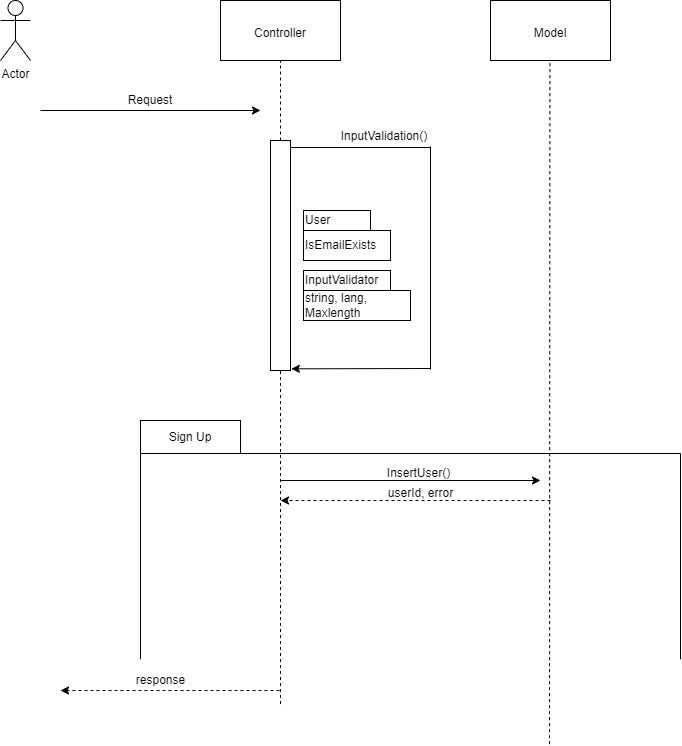

# Detail

This Project is about to validate the user Data and perform insertion and retrieval of data from the Database

**POST** `call`:

Parameter | Type | Description
--- | --- | --- |
`firstname` | `string`| **Required.** string only contains letters & numbers.
`lastname`  | `string` |**Required.** string only contains letters & numbers.
`Email Address`|`string`|**Required.** string should be valid access
`Signin_through`|`string`|**Required.** string ( Ex: Gmail, Outlook etc., )
`CreatedAt`|`string`|**Required.** string Date Time based on the timezone.
`TimeZone `|`string`|**Required.** Only must contain String & "/"
`IsActive`|`boolean`|When you receive post request, ensure you are making IsActive is true.
`Country`| `string`|**Required.** should be in string and may have space

**API urls :**

POST :- ```/user ```

**Input :**
```
{
  "firstname"    :    "Ganesh",
  "lastname"     :    "P",
  "emailaddress" :    "Ganes@gmail.com",
  "signinthrough":    "Gmail",
  "timezone"     :    "Asia/Calcutta",
  "country"      :    "India"
}
```
**Sequence Diagram**





