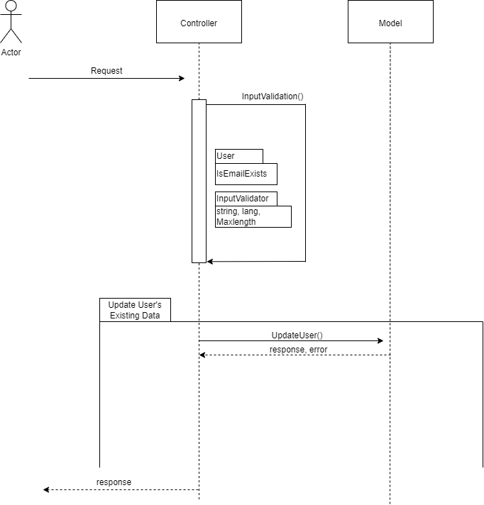

# Detail

This Project is about to validate the user Data and perform Insertion, Retrieval, Updation and Deletion of data from the User Database

**UPDATE** `call`:

Parameter | Type | Description
--- | --- | --- |
`firstname` | `string`| **Required.** string only contains letters & numbers.
`lastname`  | `string` |**Required.** string only contains letters & numbers.
`Email Address`|`string`|**Required.** string should be valid access
`Signin_through`|`string`|**Required.** string ( Ex: Gmail, Outlook etc., )
`CreatedAt`|`string`|**Required.** string Date Time based on the timezone.
`TimeZone `|`string`|**Required.** Only must contain String & "/"
`IsActive`|`boolean`|When you receive post request, ensure you are making IsActive is true.
`Country`| `string`|**Required.** should be in string and may have space

**API urls :**

UPDATE :- ```/user ```

**Input :**
```
{
  {     "id": "7upsnxr10s1zt",
        "firstname": "ArnoldSekar",
        "lastname": "S",
        "emailaddress": "Arnold@gmail.com",
        "signinthrough": "Gmail",
        "createdat": "2024-07-17 10:55:25 IST",
        "timezone": "Asia/Calcutta",
        "isactive": true,
        "country": "India"
}
```
**Sequence Diagram**





